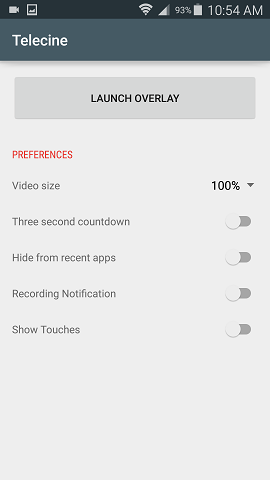
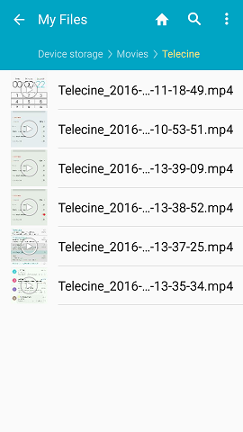

[][1]

[][1]

License
-------

    Copyright 2015 Jake Wharton

    Licensed under the Apache License, Version 2.0 (the "License");
    you may not use this file except in compliance with the License.
    You may obtain a copy of the License at

       http://www.apache.org/licenses/LICENSE-2.0

    Unless required by applicable law or agreed to in writing, software
    distributed under the License is distributed on an "AS IS" BASIS,
    WITHOUT WARRANTIES OR CONDITIONS OF ANY KIND, either express or implied.
    See the License for the specific language governing permissions and
    limitations under the License.

 [1]: https://play.google.com/store/apps/details?id=com.jakewharton.telecine

Introduction
------------

Telecine is a free Android app that supports screencasts natively without having to root the device or connect to a PC. You can download the app from the Google Play Store. After the app is installed, tap on the Telecine app icon to start the app. There is only one screen with options:

[][1]

Setup
-----

There are five preferences that can be set for the app:

1. Video size – Can choose 100/75/50 percent (need to see what happens when 75 or 50 are selected), default is 100
2. Three second countdown – A 3 second countdown will be displayed in the status bar before the start of recording, default is OFF
3. Hide from recent apps – Default is OFF 
4. Recording Notification – Default is OFF 
5. Show touches -  Default is OFF

Recording
---------

To start recording, tap the “Launch Overlay” button. A dialog window will appear informing you that Telecine will start capturing everything that is displayed on the screen. 

[][1]

This message will appear every time that the “Launch Overlay” button is pressed. To prevent this message from appearing, tap the checkbox next to the text “Don't show again”. To continue with recording, tap “Start Now” in the window. To abort the recording, tap “Cancel” in the window.

With the default settings, two icons will appear in the status bar at the top of the screen:
1. An “X” in white/gray
2. A camera

[][1]

This signals that Telecine is ready to record. You can select an app to run by tapping the left button at the base of the phone, then scrolling to the app and selecting it. To start recording, tap the camera icon at the top of the screen. The icon will disappear and recording will start. To stop recording, tap the same area in the status bar where the camera icon was displayed earlier. A new camera icon will then appear on the left side of the status bar to indicate that a video has been saved. 

[][1]

You can pull down the status bar to select the video for viewing. 

[][1]

Your device may ask you to select an app to play the video (such as Video Player) to view the screencast. Videos are stored in [Device Storage > Movies > Telecine ] 

[][1]

After recording some screencasts, you can copy them to your PC or another storage device using USB.

